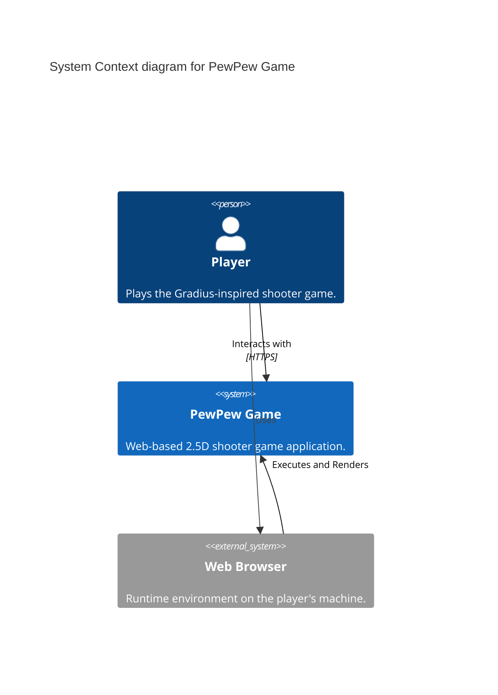

# C1 Diagram: System Context

<!-- 
This C1 diagram shows the highest level view of the system landscape.

- **Actors**: External users or systems.
- **Systems**: The software system itself and external systems it interacts with.
- **Relationships**: Interactions between actors and systems.

Updated when major product changes occur.
-->
