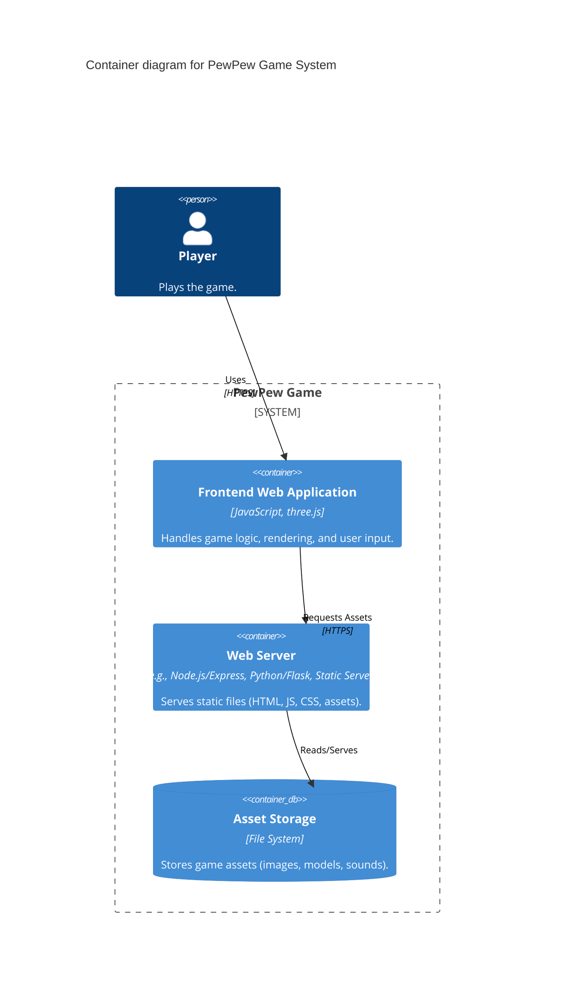

# C2 Diagram: Containers

<!--
This C2 diagram zooms into the 'PewPew Game' system from the C1 diagram.

- **Containers**: High-level technical building blocks (applications, data stores, etc.).
- **Relationships**: Interactions and data flow between containers.

Updated when there are flow changes to large systems.
-->
