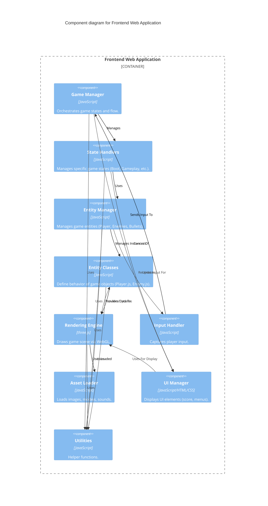

# C3 Diagram: Components

<!--
This C3 diagram zooms into the 'Frontend Web Application' container from the C2 diagram.

- **Components**: Major structural blocks (modules, classes, etc.) within the container.
- **Relationships**: Interactions between components.

Updated to ensure all key components are understood.
-->
